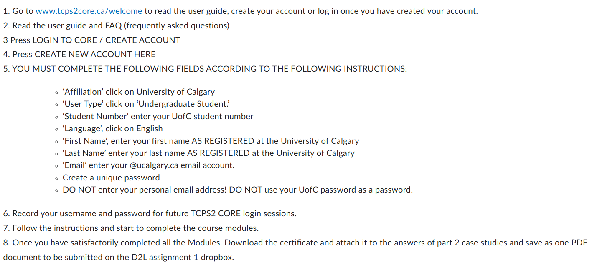
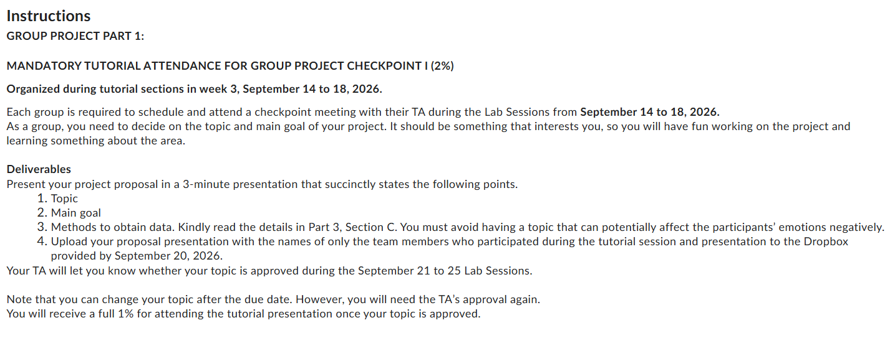

## Today's Outline
- Boring stuff, e.g. TA, communications, office hours
- Lab Session Info
- Group formation
- Movement break
- Assignment 1
- Qualtrics

## Your TA

- Call me Bonnie 
- Master's Student in Computer Science at the [Interactions Lab](https://ilab.ucalgary.ca/) under Dr. Wesley Willett
- Interests in data storytelling
- Hobbies: TV, video games, knitting

## Communications
- Email: bonnie.wu@ucalgary.ca
- I will try to respond as soon as I can on **weekdays** from **MST 9AM - 5PM**
- Email subject line: include "DATA 201 + Lab Session" e.g. "DATA 201 B03", "DATA 201 B03" 
- Office hours: Online over [Zoom](https://ucalgary.zoom.us/j/97598136593) on Thursdays from MST 11AM - 12PM
  - Meeting ID: **975 9813 6593**
  - Passcode: **325942**

## Lab Session Info
- We don't take attendance, but we will be learning content 
- Group Project checkpoint meetings: in-person
  - Worth a small amount of marks!!

## Group formation
- Are you in a [group](https://d2l.ucalgary.ca/d2l/lms/group/user_group_list.d2l?ou=769633) yet?
- Join a group on D2L under "DATA 201 > Communications > Groups"

## Movement Break
Stand on the left if you agree with the statement, and on the right if you disagree with the statement!

- You like coffee more than tea
- You enjoy watching YouTube
- You have used Netflix in the past year
- You use a smartwatch
- You have been diagnosed with a mental health condition

## Wait a moment
What's wrong with this statement? **"You have been diagnosed with a mental health condition"**

- It's private and sensitive information that could be publically exposed to other people

What might have been wrong with this activity?

- In this type of setting, people may feel pressured to participate in the activity
- I did not ask for anyone's consent, and I did not say you did not have to participate
- I did not indicate a clear need or tell you how I used it

## Assignment 1
- **DUE DATE: September 13**
- Assignment 1 details are on [D2L](https://d2l.ucalgary.ca/d2l/le/content/769633/viewContent/7727552/View)
- Link to -> [TCPS](https://tcps2core.ca/welcome)

## Assignment 1

## Qualtrics
- Login into [Qualtrics](https://www.ucalgary.ca/provost/oia/survey/accessing-qualtrics/ucalgary-qualtrics)
- You will use it for Assignment 2

## Are you ahead?
If you are ahead in assignments, consider looking at Group Project Part 1!
